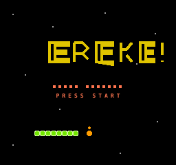
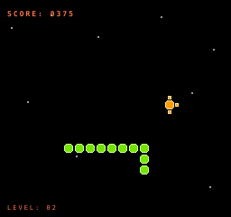
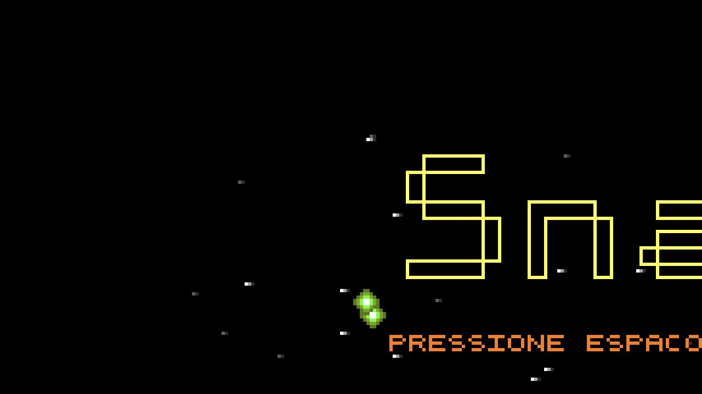

# SNAKE!

An old game, rescued from the early 2000s and given a few new homes.

SNAKE! started as a small DOS assembly game made by Bruno Costa under the
handle `_Faster` in 2003. Years later, the game was rediscovered, documented,
and reworked into a browser version and a playable NES port. The repository is
intentionally a time capsule: the original source and executable stay beside
the newer ports so the evolution can be compared rather than hidden.



## Port catalog

| Port | Era / status | What is included |
| --- | --- | --- |
| [DOS](ports/dos/) | Original, 2003 | The historical 16-bit assembly source and `snake.exe` for DOSBox. |
| [Web](ports/web/) | Original browser recreation | A self-contained HTML/JavaScript version that acts as the gameplay reference. |
| [NES](ports/nes/) | Current console port | cc65 6502 source, Mapper 0 ROMs, build script, EmulatorJS/Nestopia player, and smoke test. |

The DOS version is the artifact from the original era. The web version makes
the old game easy to inspect and play today. The NES version translates its
feel and rules into real NES constraints: tiles, OAM, vblank timing, 6502
memory, and a compact NROM image.

## Repository map

```text
ports/
├── dos/                  Original DOS assembly and executable
├── web/                  Original HTML/JavaScript port
└── nes/
    ├── src/              6502 source, NES definitions, linker config
    ├── roms/             Current and historical NES ROM images
    ├── web/              EmulatorJS/Nestopia player and test page
    ├── build/            Local cc65 object files (generated)
    ├── build.sh          Reproducible NES build script
    └── README.md         NES-specific instructions
docs/
├── PORT_STRATEGY.md      Porting and technical design notes
└── screenshots/          README visuals
```

## Quick start

### Play the browser port

From the repository root:

```bash
python3 -m http.server 8000
```

Then open [http://localhost:8000/ports/web/](http://localhost:8000/ports/web/).

### Build and play the NES port

Install [cc65](https://cc65.github.io/), then run:

```bash
./ports/nes/build.sh
```

Open `ports/nes/roms/snake.nes` in Mesen, Nestopia, FCEUX, or another NES
emulator. For the portable browser player, use a local server and open
[`ports/nes/web/jsnes-player.html`](ports/nes/web/jsnes-player.html). It uses
EmulatorJS with the Nestopia core and includes touch-friendly controls.

### Run the DOS original

Open `ports/dos/snake.exe` with DOSBox or compatible DOS software. The source
is preserved as `ports/dos/snake-source.asm` for historical reference.

## How the game plays

The snake wanders through a wrapped space field. Each movement adds one point;
eating a food dot grows the snake and awards a larger bonus. After several
pickups, the level rises and movement gets faster. The snake dies when it
collides with itself. Stars drift across the background, and the food has a
small rotating marker around it.

On the NES title screen, the snake is an attract-mode demo. It animates without
collision detection so the title can be enjoyed safely; pressing Start resets
the player snake and begins a fresh game.

## Controls

| Input | Action |
| --- | --- |
| Arrow keys / D-pad | Steer the snake |
| Start / Enter | Start, pause, or resume |
| A / B | Not used for gameplay |



The original browser port can also be seen in this captured frame:



## Curiosities and trivia

- The DOS source dates the original game to August 2003 and credits `_Faster`.
- The old executable is only a few kilobytes; the original project belongs to
  the era when a complete game could fit comfortably on a floppy disk.
- The NES build uses Mapper 0 / NROM-128: no bank switching, no expansion
  audio, and only a compact 16 KiB PRG image plus the NES's graphics memory.
- The NES snake body is drawn with background tiles instead of one sprite per
  segment. That avoids the NES limit of eight sprites on a single scanline and
  prevents long snakes from flickering or disappearing.
- Food, its orbiting sprite, and the drifting stars use OAM, while the score
  and title remain stable nametable artwork. This split is one of the key
  design decisions in the port.
- The web player is not the game itself: it is a shell around the same `.nes`
  ROM, so the browser version and an emulator are exercising the same console
  program.
- The original browser port is kept because it is the clearest reference for
  the game rules, pacing, and visual personality.

## More notes

- [NES port notes](ports/nes/README.md)
- [Porting strategy and technical decisions](docs/PORT_STRATEGY.md)
- [Original DOS files](ports/dos/)
- [Original web port](ports/web/)

This is a hobby project and historical experiment. The code is deliberately
small, direct, and occasionally quirky—the quirks are part of the story.
